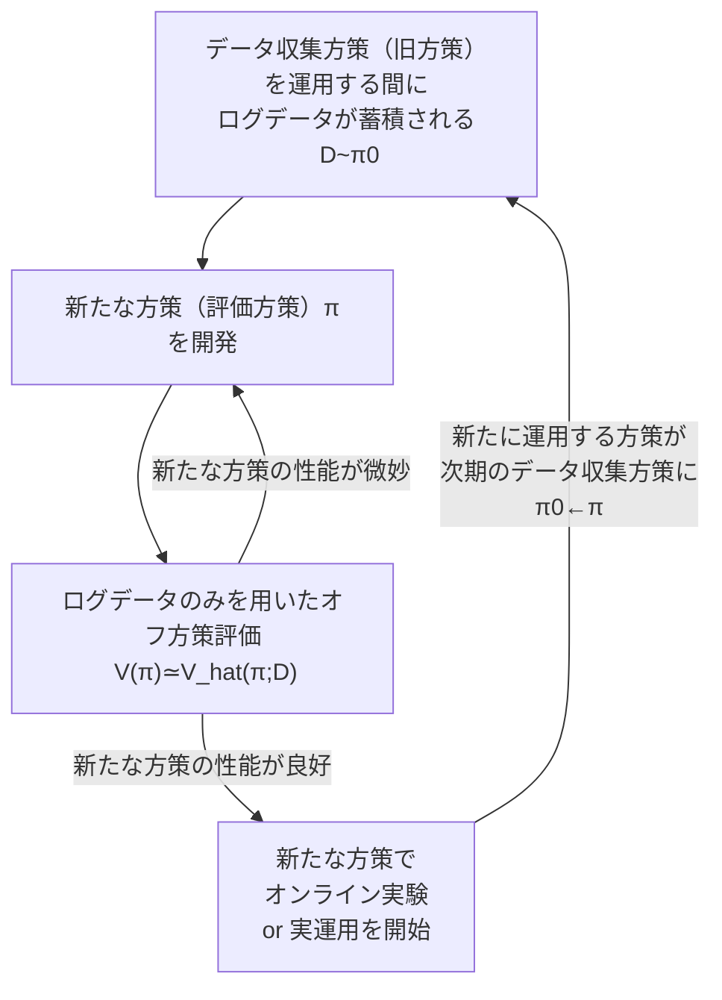

# はじめに
## 反実仮想機械学習とは
- 機械学習と因果推論の融合技術
- 機械学習との違い：
    - 典型的な機械学習では、ログデータ（過去に下した意思決定の結果）に含まれる反実仮想を考慮しない。そのまま使うと、統計的バイアスに陥るリスクがある<br>
    　→　予測誤差最小化を重視
    - 反実仮想機械学習では、ログデータから意思決定則の良さを推定・評価する<br>
    　→　意思決定の最適化を重視
- 反実仮想の分類：
    - オフ方策評価・学習（Off-Policy Evaludation and Learning: OPE/OPL）
        - 未だ実装したことがない新しい意思決定則（方策）の性能を、それとは異なる過去に運用していた方策で集めたデータから評価する方法（≒外挿問題に近い？）
    - 個別的統計効果推定（Individual Treatment Effect Estimation）
        - 個別（例えば個人ごと）の介入効果を推定する
    - 不偏推薦・ランキング学習（Unbiased Recommendation and Learnig-to-Rank）
        - 検索結果には様々なバイアスが含まれる（ユーザーがただ認識していないだけなど）。潜在的バイアスの影響を推定し、それを除去する方法を開発する

# Chapter 0: 基礎知識
## 教師あり学習
特徴量 $x$ から目的変数 $y$ を求めるための関数 $y=f(x)$ を推定する問題。
- 理想的に解きたい問題

```math
f^{*}=\text{argmin}_{f \in F}L(f)
```

```math
L(f) := \text{E}_{p(x,y)}[(y-f(x))^2]
```

- 実際に解く問題

```math
\hat{f}=\text{argmin}_{f \in F}\hat{L}(f;D)
```

```math
\hat{L}_{AVG}(f;D):=\frac{1}{n} \sum_{i=1}^n l(y_i, f(x_i))
```

典型的には、 $\hat{L}_{AVG}(f;D)$ がよく用いられるが、これが本当に適切なのかを疑う必要あり。

**平均介入効果（ATE: Average Treatment Effect）：**

```math
\tau := \text{E}_{p(y(1),y(0))}[y(1)-y(0)] = \text{E}_{p(y(1))}[y(1)] - \text{E}_{p(y(0))}[y(0)]
```

これが機能するための前提：
- 一致性：介入を受けた際には $y(1)$ を観測し、介入を受けなかった際には $y(0)$ を観測する。
- 交換性：介入有無は特徴量で条件づけた時に独立になっている。→未観測交絡が存在するとこの仮定が崩れる
- 正値性：介入を受ける確率、受けない確率はどちらもゼロではない。

**観測データの経験平均に基づくAVG推定量：**

```math
\hat{\tau}_{AVG}(D):=\frac{1}{n}\sum_{i=1}^n w_i y_i - \frac{1}{n}\sum_{i=1}^n (1-w_i) y_i
```

**経験平均に基づくAVG推定量の課題：**

上記の $\hat{\tau}_{AVG}(D)$ と $\tau$ は一致しない。

```math
\hat{\tau}_{AVG}(D)=\text{E}_{p(x,y(1))}[e(x)y(1)]-\text{E}_{p(x,y(0))}[(1-e(x))y(0)]
```

```math
\neq \tau
```

ただし、 $e(x):=\text{E}_{p(w|x)}[w]$ 、介入を受ける確率を表す。

$e(x)$ によって $\hat{\tau}_{AVG}(D)$ はバイアスを受けてしまう。<br>
→では、どのように補正するのか？<br>
→**IPS** (Inverse Propensity Score: IPS)による補正。

**IPS推定量：**

```math
\hat{\tau}_{IPS}(D) := \frac{1}{n} \sum_{i=1}^{n} \frac{w_i}{e(x_{i})}y_{i} - \frac{1}{n} \sum_{i=1}^{n} \frac{(1-w_i)}{(1-e(x_{i}))}y_{i}
```

**IPSの課題：**
- 状況によってはバリアンスが大きくなってしまう<br>
    →バリアンスを小さくする推定量など様々なトピックが存在する

# Chapter 1: 標準的なオフ方策評価
## 定式化
- 特徴量ベクトル $x \in X$
- 行動 $a \in A$
- 行動の結果得られる報酬 $r \in R$
- 意思決定方策 $\pi: X \to \Delta(A)$
    - $\Delta(A)$ は $A$ 上の確率分布の空間
    - $\pi(a|x)$ は、 $x$ で表されるデータに対して、 $a$ という行動を選択する確率を表す

**方策 $\pi$ による意思決定プロセス：**
1. 特徴量を観測する： $x_{i} \sim p(x)$
2. 方策が行動を選択する： $a_{i} \sim \pi(a|x_i)$
3. 報酬を観測する： $r_i \sim p(r|x_{i}, a_{i})$

**意思決定方策の性能：**

```math
V(\pi) := \text{E}_{p(x)\pi(a|x)p(r|x,a)}[r] = \text{E}_{p(x)\pi(x)}[q(x,a)]
```

ただし、 $q(x,a):=\text{E}_p(r|x,a)[r]$ は特徴量 $x$ , $a$ で条件付けたときの報酬 $r$ の期待値であり、**期待報酬関数**と呼ばれる。


**平均二乗誤差:**

$$\text{MSE}[V̂(π;𝒟)] = \text{E}_{\mathcal{D}} \left[ (V(π) - V̂(π;𝒟))^2 \right]$$

**平均二乗誤差の分解:**

平均二乗誤差は、推定量の **二乗バイアス（squared bias）** と **バリアンス（variance）** に分解できる。

$$\text{MSE}[V̂(π;𝒟)] = \text{Bias}[V̂(π;𝒟)]^2 + \text{Var}[V̂(π;𝒟)]$$

ここで、

$$\text{Bias}[V̂(π;𝒟)] = \mathbb{E}_{\mathcal{D}}[V̂(π;𝒟)] - V(π)$$

$$\text{Var}[V̂(π;𝒟)] = \mathbb{E}_{\mathcal{D}} [ (V̂(π;𝒟) - \mathbb{E}_{\mathcal{D}}[V̂(π;𝒟)])^2 ]$$