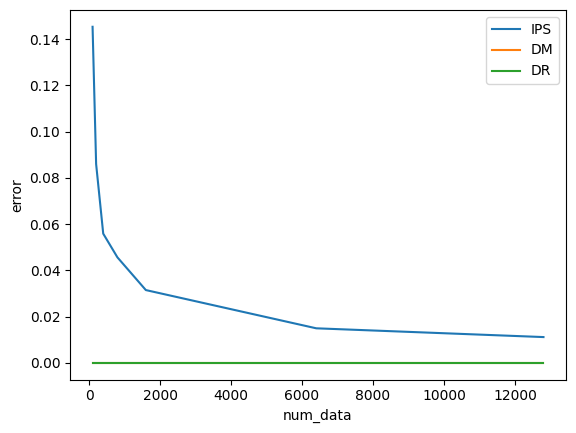
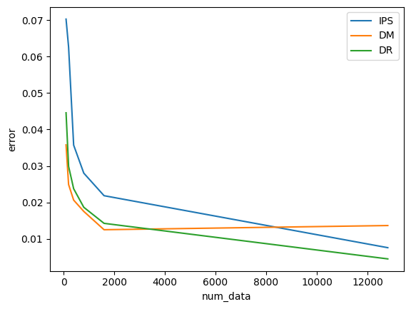

# はじめに
## 反実仮想機械学習とは
- 機械学習と因果推論の融合技術
- 機械学習との違い：
    - 典型的な機械学習では、ログデータ（過去に下した意思決定の結果）に含まれる反実仮想を考慮しない。そのまま使うと、統計的バイアスに陥るリスクがある<br>
    　→　予測誤差最小化を重視
    - 反実仮想機械学習では、ログデータから意思決定則の良さを推定・評価する<br>
    　→　意思決定の最適化を重視
- 反実仮想の分類：
    - オフ方策評価・学習（Off-Policy Evaludation and Learning: OPE/OPL）
        - 未だ実装したことがない新しい意思決定則（方策）の性能を、それとは異なる過去に運用していた方策で集めたデータから評価する方法（≒外挿問題に近い？）
    - 個別的統計効果推定（Individual Treatment Effect Estimation）
        - 個別（例えば個人ごと）の介入効果を推定する
    - 不偏推薦・ランキング学習（Unbiased Recommendation and Learnig-to-Rank）
        - 検索結果には様々なバイアスが含まれる（ユーザーがただ認識していないだけなど）。潜在的バイアスの影響を推定し、それを除去する方法を開発する

# Chapter 0: 基礎知識
## 教師あり学習
特徴量 $x$ から目的変数 $y$ を求めるための関数 $y=f(x)$ を推定する問題。
- 理想的に解きたい問題

```math
f^{*}=\text{argmin}_{f \in F}L(f)
```

```math
L(f) := \text{E}_{p(x,y)}[(y-f(x))^2]
```

- 実際に解く問題

```math
\hat{f}=\text{argmin}_{f \in F}\hat{L}(f;D)
```

```math
\hat{L}_{AVG}(f;D):=\frac{1}{n} \sum_{i=1}^n l(y_i, f(x_i))
```

典型的には、 $\hat{L}_{AVG}(f;D)$ がよく用いられるが、これが本当に適切なのかを疑う必要あり。

**平均介入効果（ATE: Average Treatment Effect）：**

```math
\tau := \text{E}_{p(y(1),y(0))}[y(1)-y(0)] = \text{E}_{p(y(1))}[y(1)] - \text{E}_{p(y(0))}[y(0)]
```

これが機能するための前提：
- 一致性：介入を受けた際には $y(1)$ を観測し、介入を受けなかった際には $y(0)$ を観測する。
- 交換性：介入有無は特徴量で条件づけた時に独立になっている。→未観測交絡が存在するとこの仮定が崩れる
- 正値性：介入を受ける確率、受けない確率はどちらもゼロではない。

**観測データの経験平均に基づくAVG推定量：**

```math
\hat{\tau}_{AVG}(D):=\frac{1}{n}\sum_{i=1}^n w_i y_i - \frac{1}{n}\sum_{i=1}^n (1-w_i) y_i
```

**経験平均に基づくAVG推定量の課題：**

上記の $\hat{\tau}_{AVG}(D)$ と $\tau$ は一致しない。

```math
\hat{\tau}_{AVG}(D)=\text{E}_{p(x,y(1))}[e(x)y(1)]-\text{E}_{p(x,y(0))}[(1-e(x))y(0)]
```

```math
\neq \tau
```

ただし、 $e(x):=\text{E}_{p(w|x)}[w]$ 、介入を受ける確率を表す。

$e(x)$ によって $\hat{\tau}_{AVG}(D)$ はバイアスを受けてしまう。<br>
→では、どのように補正するのか？<br>
→**IPS** (Inverse Propensity Score: IPS)による補正。

**IPS推定量：**

```math
\hat{\tau}_{IPS}(D) := \frac{1}{n} \sum_{i=1}^{n} \frac{w_i}{e(x_{i})}y_{i} - \frac{1}{n} \sum_{i=1}^{n} \frac{(1-w_i)}{(1-e(x_{i}))}y_{i}
```

**IPSの課題：**
- 状況によってはバリアンスが大きくなってしまう<br>
    →バリアンスを小さくする推定量など様々なトピックが存在する

# Chapter 1: 標準的なオフ方策評価
## 定式化
- 特徴量ベクトル $x \in X$
- 行動 $a \in A$
- 行動の結果得られる報酬 $r \in R$
- 意思決定方策 $\pi: X \to \Delta(A)$
    - $\Delta(A)$ は $A$ 上の確率分布の空間
    - $\pi(a|x)$ は、 $x$ で表されるデータに対して、 $a$ という行動を選択する確率を表す

**方策 $\pi$ による意思決定プロセス：**
1. 特徴量を観測する： $x_{i} \sim p(x)$
2. 方策が行動を選択する： $a_{i} \sim \pi(a|x_i)$
3. 報酬を観測する： $r_i \sim p(r|x_{i}, a_{i})$

**意思決定方策の性能：**

```math
V(\pi) := \text{E}_{p(x)\pi(a|x)p(r|x,a)}[r] = \text{E}_{p(x)\pi(x)}[q(x,a)]
```

ただし、 $q(x,a):=\text{E}_p(r|x,a)[r]$ は特徴量 $x$ , $a$ で条件付けたときの報酬 $r$ の期待値であり、**期待報酬関数**と呼ばれる。


**平均二乗誤差:**

$$\text{MSE}[V̂(π;𝒟)] = \text{E}_{\mathcal{D}} \left[ (V(π) - V̂(π;𝒟))^2 \right]$$

**平均二乗誤差の分解:**

平均二乗誤差は、推定量の **二乗バイアス（squared bias）** と **バリアンス（variance）** に分解できる。

$$\text{MSE}[V̂(π;𝒟)] = \text{Bias}[V̂(π;𝒟)]^2 + \text{Var}[V̂(π;𝒟)]$$

ここで、

```math
\text{Bias}[V̂(π;𝒟)] = \mathbb{E}_{\mathcal{D}}[V̂(π;𝒟)] - V(π)
```

```math
\text{Var}[V̂(π;𝒟)] = \mathbb{E}_{\mathcal{D}} [ (V̂(π;𝒟) - \mathbb{E}_{\mathcal{D}}[V̂(π;𝒟)])^2 ]
```

一般にバイアスとバリアンスの間にはトレードオフの関係がある。

## 標準的な推定量とその性質
### オンライン実験における方策推定
- オンライン実験とは？
    - 評価方策πそのものを実装して得たログデータを使ってV(π)を推定すること（A/Bテストなど）

#### AVG推定量

**定義：**
```math
\hat{V}_{AVG}(\pi;\mathcal{D}_{online}):=\frac{1}{n}\sum_{i=1}^{n}r_i
```

**性質：**
- バイアスゼロ！

### オフライン実験における方策推定
#### Direct Method (DM)推定量
**定義：**

```math
\hat{V}_{DM}(\pi,\mathcal{D},\hat{q}):=\frac{1}{n}\sum_{i=1}^{n} \hat{q}(x_i, \pi) = \frac{1}{n}\sum_{i=1}^{n} \sum_{a \in \mathcal{A}} \pi(a|x_i)\hat{q}(x_i, a) 
```

ただし、 $\hat{q}(x_i, a)$ は期待報酬関数 $q(x_i, a)$ の推定モデル。例えば、以下のような教師あり学習により得られる。

```math
\hat{q}(x_i, a) = \text{argmin}_{q' \in \mathcal{Q}} \frac{1}{n} \sum_{i=1}^{n} l_{r}(r_{i}, q'(x_i, a_i))
```

**課題：**

Nを大きくしてもバイアスを除去できない（ことがある）。以下において、 $\Delta_{q,\hat{q}}(x,a)$ はモデルの精度。モデル精度改善のためには、 $q(x,a)$ が広くアクションをサポートする必要があるが、一般にそのような仮定を満たさないことが多い。

- バイアス：

```math
\text{Bias}[\hat{V}_{DM}(\pi;\mathcal{D},\hat{q})]=\mathbb{E}_{p(x)\pi(a|x)}[\Delta_{q,\hat{q}}(x,a)]
```

```math
\Delta_{q,\hat{q}}(x,a):=\hat{q}(x,a)-q(x,a)
```

- バリアンス：

```math
\text{Var}[\hat{V}_{DM}(\pi;\mathcal{D},\hat{q})]=\frac{1}{n}\mathbb{V}_{p(x)}[\hat{q}(x,\pi)]
```

#### Inverse Propensity Score (IPS)推定量
**定義：**

```math
\hat{V}_{IPS}(\pi,\mathcal{D}):=\frac{1}{n}\sum_{i=1}^{n} \frac{\pi(a_i|x_i)}{\pi_{0}(a_i|x_i)}r_{i} = \frac{1}{n}\sum_{i=1}^{n} w(x_i, a_i) r_{i}
```

**課題：**

データ収集方策と大きく異なるデータ収集方策を評価する際に、バリアンスが大きくなる。

- バイアス：

```math
\text{Bias}[\hat{V}_{\text{IPS}}(\pi; D)] = -\mathbb{E}_{p(x)}\left[\sum_{a \in \mathcal{A}(x, \pi, m)} \pi(a) q(a, x)\right]
```
ただし、共通サポートの仮定が満たされる場合、

```math
\text{Bias}[\hat{V}_{DM}(\pi;\mathcal{D})]=0
```

```math
\big( \mathbb{E}_{p(\mathcal{D})} [\hat{V}_{IPS}(\pi;\mathcal{D})]=V(\pi) \big)
```

- バリアンス：

```math
\text{MSE}[\hat{V}_{IPS}(\pi;\mathcal{D})]= \text{Var}[\hat{V}_{IPS}(\pi;\mathcal{D})]\\ 
```

```math
=\frac{1}{n} \Big( \mathbb{E}_{p(x)\pi_{0}(a|x)}[w(x,a)q(x,a)] + \mathbb{E}_{p(x)}\big[\mathbb{V}_{\pi_{0}(a|x)}[w(x,a)q(x,a)]\Big] + \mathbb{V}_{p(x)}[q(x,\pi)]\Big)
```

#### Doubly Robust (DR)推定量
**定義：**

```math
\hat{V}_{\text{DR}}(\pi; D, \hat{q}) = \frac{1}{n} \sum_{i=1}^n \big[\hat{q}(x_i, a_i; \pi) + w(x_i, a_i) (r_i - \hat{q}(x_i, a_i)) \big]
```

```math
= \hat{V}_{\text{DM}}(\pi; D, \hat{q}) + \frac{1}{n} \sum_{i=1}^n w(x_i, a_i) (r_i - \hat{q}(x_i, a_i))  
```

#### 推定量の比較
|     | DM推定量 | IPS推定量 | DR推定量 |
|-----|-----|-----|-----|
| アイデア | 期待報酬関数を推定 | 重要度重みによる報酬の重みづけ平均 | DMとIPSの組み合わせ |
| バイアス | **大** | ゼロ | ゼロ |
| バリアンス | 小 | **大** | 中 |

#### 数値実験
- 報酬モデルが正しい場合と、そうでない場合とで、各種推定量による誤差を比較した

##### 報酬モデルが正しい場合:
- 以下の線形モデルでデータを生成
```python
class Simulator:
    def generate_linear_data(self):
        num_data = self.num_data

        # x1, x2という説明変数を正規分布から生成し、それに基づいて確率・介入変数・報酬を生成
        self.df = pd.DataFrame({
            "x1": np.random.normal(size=num_data),
            "x2": np.random.normal(size=num_data),    
        }).assign(
            # 介入が行われる確率をシグモイド関数で計算
            prob_t = lambda df: sigmoid(df.x1**2+df.x2),
            # ランダムに介入の実施有無を決定（prob_tに基づく）
            t = lambda df: (df.prob_t >= np.random.uniform(size=num_data))*1,
            # 報酬はx1, x2に介入の有無を加味して決定
            reward = lambda df: df.x1 - df.x2 + df.t
        )
```
- DM、DRでは線形モデルを用いて報酬を推定
```python
class Simulator:
    def IPS(self):
        df = self.df
        # 介入の確率をロジスティック回帰で推定
        mode = LogisticRegression().fit(X=df[["x1", "x2"]], y=df["t"]==1)
        df["t_pred"] = mode.predict_proba(df[["x1", "x2"]])[:,1]

        # 介入が行われた場合と行われなかった場合の報酬を推定（逆確率重み付き平均）
        df["reward_treatment"] = df["reward"]*df["t"]/df["t_pred"]
        df["reward_no_treatment"] = df["reward"]*(1-df["t"])/(1-df["t_pred"])

        # 推定された因果効果の誤差（真の効果との差）を計算
        return abs((df["reward_treatment"]-df["reward_no_treatment"]).mean()-1)

    def DM(self):
        df = self.df
        # 線形回帰で報酬を予測（説明変数はx1, x2, t）
        mode = LinearRegression().fit(X=df[["x1", "x2", "t"]], y=df["reward"])
        
        # 介入が行われた場合と行われなかった場合の報酬を予測
        df["reward_treatment"] = mode.predict(df[["x1", "x2", "t"]].assign(t=1))
        df["reward_no_treatment"] = mode.predict(df[["x1", "x2", "t"]].assign(t=0))

        # 推定された因果効果の誤差（真の効果との差）を計算
        return abs((df["reward_treatment"]-df["reward_no_treatment"]).mean()-1)

    def DR(self):
        df = self.df
        # 線形回帰で報酬を予測（説明変数はx1, x2, t）
        mode1 = LinearRegression().fit(X=df[["x1", "x2", "t"]], y=df["reward"])
        
        # 介入が行われた場合と行われなかった場合の報酬を予測
        df["reward_treatment_pred"] = mode1.predict(df[["x1", "x2", "t"]].assign(t=1))
        df["reward_no_treatment_pred"] = mode1.predict(df[["x1", "x2", "t"]].assign(t=0))

        # 介入の確率をロジスティック回帰で推定
        mode2 = LogisticRegression().fit(X=df[["x1", "x2"]], y=df["t"]==1)
        df["t_pred"] = mode2.predict_proba(df[["x1", "x2"]])[:,1]

        # 介入が行われた場合と行われなかった場合の報酬を推定（逆確率重み付き平均）
        df["weight_treatment"] = df["t"]/df["t_pred"]
        df["weight_no_treatment"] = (1-df["t"])/(1-df["t_pred"])

        df["reward_treatment"] = df["reward_treatment_pred"]+df["weight_treatment"]*(df["reward"]-df["reward_treatment_pred"])
        df["reward_no_treatment"] = df["reward_no_treatment_pred"]+df["weight_no_treatment"]*(df["reward"]-df["reward_no_treatment_pred"])

        # 推定された因果効果の誤差（真の効果との差）を計算
        return abs((df["reward_treatment"]-df["reward_no_treatment"]).mean()-1)
```
- 結果、DM、DRは誤差ゼロ。IPSはデータ量が増えるにつれて誤差減。

##### 報酬モデルが正しい場合:
- 以下の線形モデルでデータを生成
```python
class Simulator:
    def generate_nonlinear_data(self):
        num_data = self.num_data

        # x1, x2という説明変数を正規分布から生成し、それに基づいて確率・介入変数・報酬を生成
        self.df = pd.DataFrame({
            "x1": np.random.normal(size=num_data),
            "x2": np.random.normal(size=num_data),    
        }).assign(
            # 介入が行われる確率をシグモイド関数で計算（非線形な関係を反映）
            prob_t = lambda df: sigmoid(df.x1+df.x2),
            # ランダムに介入の実施有無を決定（prob_tに基づく）
            t = lambda df: (df.prob_t >= np.random.uniform(size=num_data))*1,
            # 報酬は非線形な関数で計算
            reward = lambda df: sigmoid(np.sin(df.x1) - df.x2**4) + df.t
        )
```
- モデルは上記同様、線形モデルを使用
- この時、DMではデータを増やしても誤差が減らない
- IPS、DRではデータ量を増やすにつれて誤差が減る
- また、DRはIPSを上回る精度を出している


## 改善のテクニック
### Clipped Inverse Propensity Score (CIPS)
データ収集方策 π₀ が収集したデータ D が与えられたとき、評価方策の性能 V(π) に対する Clipped Inverse Propensity Score (CIPS) 推定量は、次のように表される。

```math
\hat{V}_{\text{CIPS}}(\pi; D, \lambda) = \frac{1}{n} \sum_{i=1}^n \min[w(x_i, a_i; \lambda), \lambda] r_i
```

なお、λ ≥ 0 は CIPS 推定量のバイアス・バリアンス・トレードオフを調整するハイパーパラメータである。また $w(x_i, a_i; λ) = π(a_i|x_i) / π₀(a_i|x_i)$ は、IPS 推定量と同様の重要度重みである。

### Self-Normalized Inverse Propencity Score (SNIPS)
データ収集方策 π₀ が収集したログデータ D が与えられたとき、評価方策の性能 V(π) に対する Self-Normalized Inverse Propensity Score (SNIPS) 推定量は、次のように表される。

```math
\hat{V}_{\text{SNIPS}}(\pi; D) = \frac{1}{\sum_{i=1}^n w(x_i, a_i)} \sum_{i=1}^n w(x_i, a_i) r_i
```

なお $w(x, a) = π(a|x) / π₀(a|x)$ は、IPS 推定量と同様の重要度重みである。

**利点：**

SNIPS推定量はハイパーパラメータチューニングや期待報酬関数の推定モデルq(x, a)の学習を行う必要が一切ないにもかかわらず、多くの場合IPS推定量よりも正確でDR推定量にも匹敵する精度を発揮できるため、(適切にチューニングされたほかの推定量の方が正確である可能性は大いにあり) 初手に用いる推定量として便利。

### Switch Doubly Robust (Switch-DR)
データ収集方策 π₀ が収集したログデータ D が与えられたとき、評価方策の性能 V(π) に対する Switch Doubly Robust (Switch-DR) 推定量は、次のように定義される。

```math
\hat{V}_{\text{Switch-DR}}(\pi; D, q, \lambda) = \frac{1}{n} \sum_{i=1}^n \left\{q(x_i, \pi_i) + w(x_i, a_i) I\{w(x_i, a_i) \leq \lambda\} (r_i - q(x_i, a_i)) \right\}
```

```math
= \hat{V}_{\text{DM}}(\pi; D, q) + \frac{1}{n} \sum_{i=1}^n w(x_i, a_i) I\{w(x_i, a_i) \leq \lambda\} (r_i - q(x_i, a_i))
```

なお λ ≥ 0 は、Switch-DR 推定量のバイアス・バリアンストレードオフを調整するハイパーパラメータである。また $I\{·\}$ は指示関数であり、入力となる命題が真のとき1を偽のとき0を出力する。 $w(x,a) := π(a|x) / π₀(a|x)$ は、IPS 推定量と同様の重要度重みである。